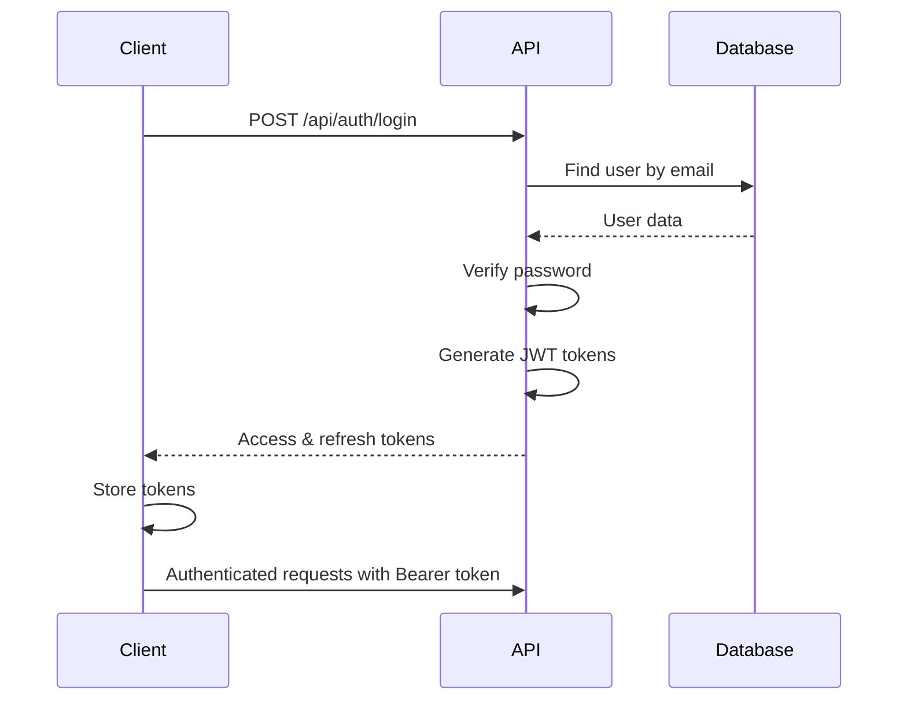
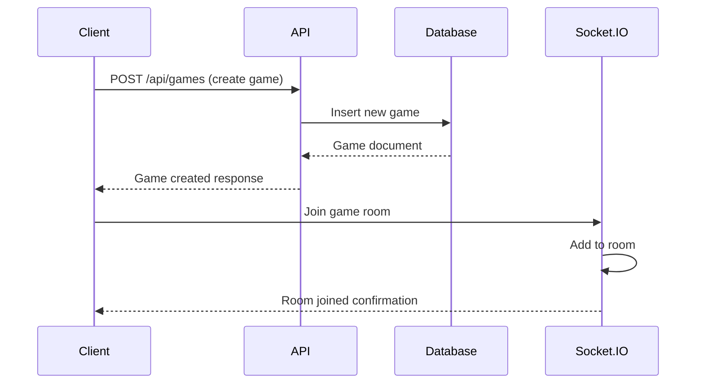
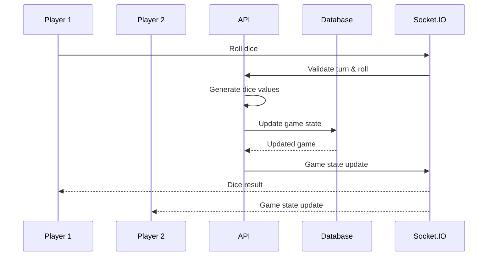

# Integration Specification - Yahtzee Game

## Overview
This document outlines the integration between the React frontend, Express.js backend, and MongoDB database for the Yahtzee game application, including API contracts, data flow, and communication protocols.

## System Architecture
```
┌─────────────────┐     HTTP/WebSocket     ┌─────────────────┐     Mongoose     ┌─────────────────┐
│   React Client  │◄────────────────────►│  Express API    │◄──────────────►│   MongoDB       │
│   (Port 3000)   │                       │   (Port 5000)   │                 │   (Port 27017)  │
└─────────────────┘                       └─────────────────┘                 └─────────────────┘
```

## API Communication

### HTTP Client Configuration
```typescript
// Frontend: services/api.ts
const API_BASE_URL = process.env.VITE_API_URL || 'http://localhost:5000';

class ApiClient {
  private instance: AxiosInstance;

  constructor() {
    this.instance = axios.create({
      baseURL: `${API_BASE_URL}/api`,
      timeout: 10000,
      headers: {
        'Content-Type': 'application/json',
      },
    });

    // Request interceptor for auth token
    this.instance.interceptors.request.use((config) => {
      const token = localStorage.getItem('accessToken');
      if (token) {
        config.headers.Authorization = `Bearer ${token}`;
      }
      return config;
    });

    // Response interceptor for token refresh
    this.instance.interceptors.response.use(
      (response) => response,
      async (error) => {
        if (error.response?.status === 401) {
          await this.refreshToken();
          return this.instance.request(error.config);
        }
        return Promise.reject(error);
      }
    );
  }
}
```

### Backend CORS Configuration
```typescript
// Backend: middleware/cors.ts
const corsOptions = {
  origin: process.env.CORS_ORIGIN || 'http://localhost:3000',
  credentials: true,
  optionsSuccessStatus: 200,
  methods: ['GET', 'POST', 'PUT', 'DELETE', 'PATCH'],
  allowedHeaders: ['Content-Type', 'Authorization', 'X-Requested-With'],
};

app.use(cors(corsOptions));
```

## Data Flow Patterns

### Authentication Flow


### Game Creation Flow


### Game Action Flow


## API Contracts

### Standard Response Format
```typescript
interface ApiResponse<T> {
  success: boolean;
  data?: T;
  error?: {
    message: string;
    code?: string;
    details?: any;
  };
  timestamp: string;
}

interface PaginatedResponse<T> extends ApiResponse<T[]> {
  meta: {
    page: number;
    limit: number;
    total: number;
    totalPages: number;
  };
}
```

### Authentication Endpoints

#### Login
```typescript
// Request
POST /api/auth/login
{
  "email": "user@example.com",
  "password": "Password123!"
}

// Response
{
  "success": true,
  "data": {
    "user": {
      "id": "648a1b2c3d4e5f6789012345",
      "username": "player1",
      "email": "user@example.com"
    },
    "accessToken": "eyJhbGciOiJIUzI1NiIsInR5cCI6IkpXVC